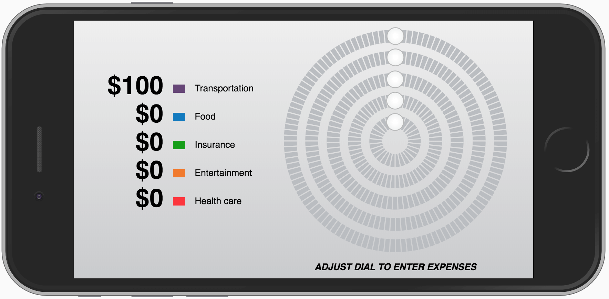

# Web Developer Task - Circular Slider



## Introduction

This is my solution of a reusable circular slider class. The slider and also the rest of the app are fully responsive. It was tested in the last 2 versions of the most popular browsers.

I have also implemented a very simple and naive template engine. It supports creating, referencing and styling of DOM nodes.

## Quick Start

1. Clone and install dev dependencies:
    ```sh
    git clone https://github.com/mikirejf/circular-slider.git
    cd circular-slider
    npm install
    ```

2. Serve the app using a dev server:
    ```sh
    npm run dev
    ```
    
The app should be available at `http://localhost:8080` and also through the local network at
`http://<local_ip_address>:8080`.


## Building 

To build for production, run `npm run build`.

### Building for a specific browser target

Because the development was targeted to cover the last two versions of major browsers, the solution doesn't work for example on iOS 9. To enable testing in older browsers I have included a Babel build command, which is currently targeted at iOS 9. To test the app on a iOS 9 device, run: 

```sh
npm run build-babel
``` 

or

```sh 
npm run dev-babel
```
to run a dev server with `babel-loader` enabled.

If you would also want to build for some other browser you can add more targets
to the `.babelrc` file.
